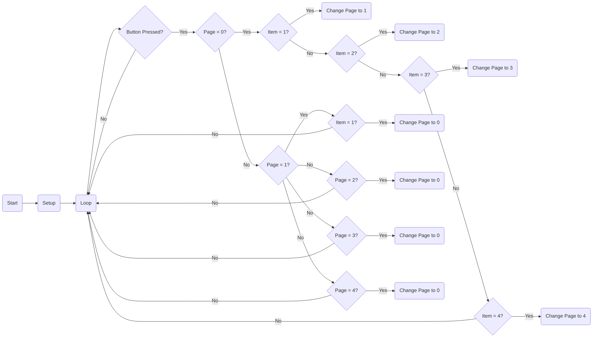

# General

This code is written in C++ and is designed to be used with an Arduino board and an SSD1306 OLED display. It allows the user to navigate through a menu system displayed on the OLED screen using three buttons: Up, OK, and Down. The code utilizes the Adafruit SSD1306 library to control the OLED display.

## Hardware Requirements

To use this code, you will need the following hardware components:

- Arduino board (e.g., Arduino Uno)
- SSD1306 OLED display
- Three buttons (connected to pins 7, 6, and 5)

## Software Requirements

The code requires the following libraries:

- Wire.h (included in the Arduino IDE by default)
- Adafruit_SSD1306.h (installable from the Arduino Library Manager)
- Adafruit_GFX.h (installable from the Arduino Library Manager)

## Setup

1. Connect the SSD1306 OLED display to the Arduino board using the I2C interface (SDA and SCL pins).
2. Connect the three buttons to the Arduino board. Assign the corresponding pin numbers to `btn_Up`, `btn_OK`, and `btn_DOWN` constants in the code.
3. Install the required libraries if they are not already installed.
4. Upload the code to the Arduino board.

## Functionality

The code implements a menu system with multiple pages. The initial page is "DAFTAR MENU" (which means "MENU LIST" in Indonesian) and displays four items. The user can navigate through the items using the Up and Down buttons. The currently selected item is indicated by a ">" symbol.

Pressing the OK button selects the current item and takes the user to the corresponding page. Pressing OK again on any of the subpages labeled "page X" will take the user back to the main menu. The Back option is always the last item on each subpage and allows the user to navigate back to the main menu.

The `tampil()` function handles the display of different pages on the OLED screen. Each page has its own layout and content defined in this function.

## Flowchart 

## Image

## Customization

You can modify the code to suit your specific requirements. Here are some possible modifications:

- Adjust the pin numbers for the buttons by changing the `#define` statements.
- Customize the menu items and their corresponding actions in the `btn_ok_pressed()` function.
- Modify the `tampil()` function to change the layout and content of the menu pages.

## Troubleshooting

If the OLED display is not working correctly, make sure you have correctly connected the display to the Arduino board and that the required libraries are installed. Check the wiring and ensure the correct I2C address is used in the `lcd.begin()` function.

If the buttons are not functioning as expected, check the connections and ensure the correct pin numbers are assigned in the code.

## License

This code is provided under the MIT license. Feel free to modify and use it for your own projects.

## Credits

This code utilizes the Adafruit SSD1306 library for controlling the OLED display. The library is developed by Adafruit Industries and can be found at: [https://github.com/adafruit/Adafruit_SSD1306](https://github.com/adafruit/Adafruit_SSD1306)
